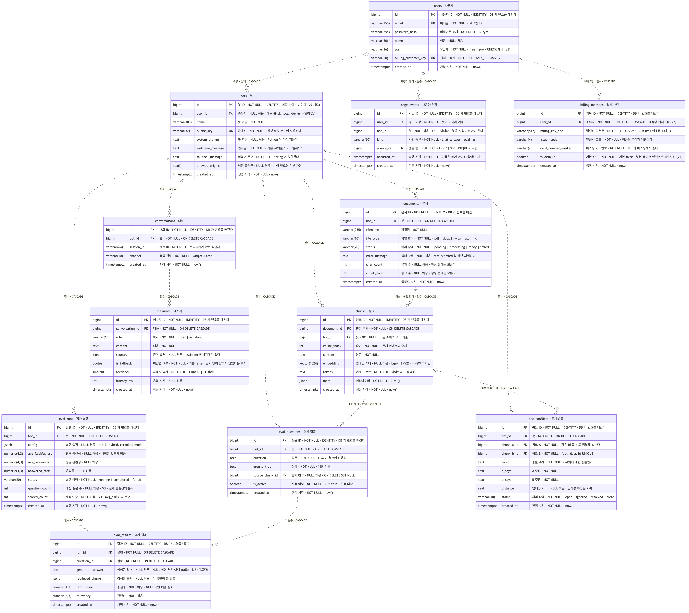
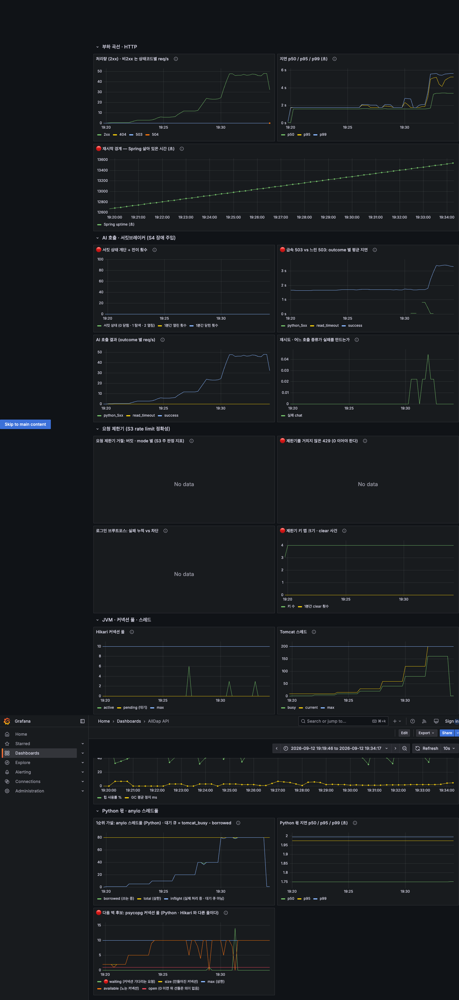

<div align="center">

# AllDap

**문서를 올리면 출처가 표시되는 한국어 RAG 챗봇**을 만들어주고,
그 챗봇이 얼마나 정확한지 **자동 평가 리포트로 증명**하는 서비스.

site: **https://all-dap.vercel.app**

<br/>


</div>

---

## Table of Contents

- [Demo](#demo)
- [핵심 지표](#핵심-지표)
- [System Architecture](#system-architecture)
- [ERD](#erd)
- [Tech Stack](#tech-stack)
- [Monitoring](#monitoring)
- [Documentation](#documentation)

---

## Demo

### 1. 문서 업로드

PDF · DOCX · HWPX 를 올리면 파싱 → 청킹 → 임베딩이 백그라운드로 돌고,
`pending → processing → ready` 로 상태가 바뀝니다.
임베딩은 수십 초가 걸릴 수 있어 업로드 응답(202)과 처리를 분리했습니다.


### 2. 출처가 붙은 답변

답변마다 **어느 문서의 어느 대목에서 나왔는지**를 함께 내려줍니다.


### 3. 근거가 없으면 답하지 않는다

이 제품이 존재하는 이유입니다. 문서에 근거가 없으면 지어내지 않고 fallback 합니다.
방어선이 두 겹입니다.

| 겹 | 무엇 | 어디서 막히나 |
|---|---|---|
| 1차 | 검색 단계 판정 (`answerable_max_distance`) | **LLM 을 아예 호출하지 않는다** |
| 2차 | 생성 단계 (`NO_ANSWER`) | LLM 이 근거를 읽고 "없다" 고 답한다 |

문서에 없는 질문 10개로 재면 **10/10 fallback**, 대조군(문서에 답이 있는 질문) 3/3 정상 답변입니다.
그중 **8건은 1차에서 잘려 LLM 을 부르지도 않습니다.**


### 4. 품질 대시보드

**이 프로젝트의 심장입니다.** 청크에서 테스트 질문을 자동 생성하고,
답변 생성과 **계열이 다른** 모델로 채점합니다(자기 채점 방지).


### 5. 한 줄 설치 위젯

고객 사이트에 `<script>` 한 줄을 넣으면 로더가 iframe 으로 채팅 화면을 띄웁니다.
허용하지 않은 도메인은 차단됩니다(빈 허용 목록은 "전부 허용" 이 아니라 **"전부 차단"** 입니다).

```html
<script src="https://alldap.duckdns.org/widget/alldap-widget.js"
        data-public-key="pk_xxxxxxxx"></script>
```


---

## 핵심 지표

검색 품질을 개선하고 **같은 평가셋으로 before/after 를 쟀습니다.**
같은 16문항 · 50문서 · 306청크 · 같은 모델 · `temperature=0` · 설정당 3회 이상.

| 설정 | 전체 충실성 | 회당 오답 | 회당 완전오답 | 채팅 지연 |
|---|---|---|---|---|
| 벡터 검색만 (before) | 0.781 | 1.75 | 1.00 | 0.67초 |
| **리랭커 + 하이브리드 (after, 현재 기본값)** | **0.875** | **0.00** | **0.00** | 1.56초 |

🔴 **결정적 근거는 평균이 아니라 오답입니다.** fallback 개수는 네 설정 모두 2로 같습니다.
즉 켠다고 "못 답하는 질문" 이 느는 게 아니라, fallback 의 **내용물**이 바뀌면서
**자신 있게 틀린 답이 사라집니다.** fallback 은 안전한 실패("담당자에게 문의하세요")지만
오답은 사용자가 잘못된 정보를 신뢰하게 만듭니다.

<details>
<summary><b>수치보다 이 과정이 더 중요합니다</b></summary>

<br/>

측정을 믿을 수 있게 만들기까지 **뭉개진 사실**을 네 번 찾아 고쳤습니다.

1. **응답률의 분모에 처리 실패가 섞여 있었다.** "답을 못 했다" 와 "물어보지도 못했다" 는 다릅니다.
2. **`avg_faithfulness` 로 설정을 비교하고 있었다.** 답을 덜 할수록 올라가는 지표였습니다(생존 편향).
   분모를 기록하는 컬럼을 추가하고 "전체 충실성" 을 새로 정의했습니다.
3. **채점자와 리랭커가 청크의 앞 200자만 보고 있었다.** 생성 모델은 전체를 보는데
   판정자는 절반만 봤습니다. **정답을 맞힌 답변이 0점**을 받고 있었습니다.
4. **진짜 병목은 검색 알고리즘이 아니라 청킹이었다.** 478자 청크 하나에 조항 4개가 들어 있었고,
   그 임베딩은 네 주제의 평균이라 구체적인 질문에 걸리지 않았습니다.
   **후보에 못 들어온 문서는 리랭커가 순위를 올려줄 수도 없습니다.**

그리고 `temperature=0` 을 명시한 뒤에도 **재현되지 않았습니다.**
같은 설정 4회가 0.781 · 0.781 · 0.781 · 0.813 으로 갈렸습니다(폭 0.032).
검색은 완전히 결정적이었고(두 실행의 top5 가 순서까지 동일) 갈린 것은 생성 모델이었습니다.
→ **0.032 보다 작은 개선은 노이즈와 구별되지 않습니다. 설정당 3회 이상 잽니다.**

</details>

---

## System Architecture


<!--
  🔴 이 그림은 아직 안 들어왔다. docs/images/architecture.png 로 넣으면 위 자리에 뜬다.
     그림이 <반드시> 담아야 하는 것 (아래 표·원칙과 어긋나면 안 된다):

     ① 배포 경계 4개가 상자로 갈라져 있을 것
        Vercel / AWS EC2 / AWS RDS / 외부 API
     ② EC2 안에 컨테이너가 <셋> 이라는 것 (caddy · api · ai-service)
        - 한 상자로 묶으면 "한 컨테이너" 로 읽힌다. 실제로는 이미지도 셋이다
     ③ 그 셋 중 caddy 만 호스트에 포트를 게시한다는 것
        - 이 그림이 하려는 말의 핵심이다
     ④ 화살표 방향: 브라우저 → Vercel → Caddy → Spring → Python
        Spring → RDS(JPA) · Spring → Toss / Python → RDS(SQL) · Python → Cloudflare·Gemini
     ⑤ Prometheus·Grafana·k6 를 그린다면 EC2 <밖> 에 둘 것 (운영 스택에 없다)
-->

**배포 경계마다 도는 곳이 다릅니다.**

| 경계 | 무엇이 도나 | 어떻게 배포되나 |
|---|---|---|
| **Vercel** | Next.js 16 | `main` 머지 시 자동 |
| **AWS EC2** t3.micro · 1GB | Caddy · Spring Boot · FastAPI | CI 가 GHCR 에 올린 이미지를 `docker pull` |
| └ **docker compose 네트워크** | **컨테이너 3개: `caddy` · `api` · `ai-service`** | 한 덩어리가 아니라 **따로 도는 셋**이고, 같은 브리지 네트워크라 서로를 이름으로 부른다 |
| **AWS RDS** | PostgreSQL 16 + pgvector | 관리형. 같은 VPC 라 인터넷을 거치지 않는다 |
| **외부 API** | Cloudflare · Gemini · Toss | 우리가 배포하지 않는다 |
| **CI/CD** | GitHub Actions · GHCR | 1GB 서버에서는 Gradle 컴파일이 OOM 이라 빌드를 CI 로 뺐다 |
| **계측 · 부하테스트** | Prometheus · Grafana · k6 | **운영 스택에 없다.** 로컬과 부하테스트에서만 띄운다 |

🔴 **그 셋 중 `caddy` 만 호스트에 포트를 게시합니다.** `docker-compose.prod.yml` 에서
**`ports:` 를 쓰는 서비스가 `caddy` 하나뿐**이고, `api` 와 `ai-service` 에는 아예 없습니다.
그래서 Spring 의 :8080 도, Python 의 :8001 도 **호스트에 뜨지 않습니다.**
특히 FastAPI 의 `/internal/*` 에는 인증이 없어서, 포트가 하나라도 열리면 누구나 남의 봇 문서를 읽습니다.
**"방화벽으로 막는다" 가 아니라 애초에 호스트에 뜨지 않게** 했습니다.
방화벽 규칙은 잊거나 실수로 지울 수 있지만, 안 열린 포트는 실수할 여지가 없습니다.
배포 후 밖에서 Python(:8001)·Spring 직통(:8080)·RDS(5432) 셋 다 막혀 있는 것을 실측했습니다.

**원칙 셋. 이걸 어기면 구조가 무너집니다.**

1. **외부 트래픽은 Spring 만 받습니다.** 브라우저에서 오는 길은 Caddy → Spring 하나뿐이고,
   나머지 경로로는 밖에서 들어올 수 없습니다.
2. **외부 LLM API 키는 Python 서비스만 가집니다.** Spring 도 Next.js 도 키를 갖지 않습니다.
3. **Next.js 는 API 게이트웨이가 아닙니다.** 브라우저는 Python 을 직접 부르지 않고,
   인증·권한·`bot_id` 격리는 전부 Spring 이 책임집니다.

**왜 두 언어로 나눴나.** AI 파이프라인(문서 파싱·임베딩·평가)은 Python 생태계가 사실상 필수고,
인증·트랜잭션·권한은 Spring 이 강합니다. 국내에서도 카카오페이(모델은 Python, 서빙은 Kotlin+Spring),
쏘카가 같은 구조를 씁니다.

<details>
<summary><b>알려진 약점 (숨기지 않습니다)</b></summary>

<br/>

- **공유 DB 는 마이크로서비스 안티패턴입니다.** 1인 개발에서는 데이터 동기화 비용이 분리 이득보다
  커서 택했지만, 팀·트래픽이 커지면 DB 를 나누고 API 로만 통신해야 합니다.
- **Spring 이 Python 을 동기 호출하므로 Python 이 죽으면 채팅이 죽습니다.**
  `AiServiceClient.call()` 안에 타임아웃·재시도·서킷브레이커를 붙였습니다.
  **재시도는 연결 실패에만 합니다.** 5xx 는 Python 이 이미 요청을 받았다는 뜻이라,
  재시도하면 문서 행이 중복되거나 LLM 이 두 번 과금됩니다.
- **배포 대상이 3개입니다.** "운영할 것의 개수를 최소화한다" 는 원칙과 충돌하는 선택이며,
  풀스택 역량 증명을 위해 알고 택했습니다.
- **백그라운드 처리가 FastAPI `BackgroundTasks`** 라 프로세스가 죽으면 작업이 유실됩니다.
  트래픽이 붙으면 Redis + RQ 로 교체해야 합니다.

</details>

<details>
<summary><b>테이블 소유권 (두 서비스가 같은 DB 를 공유하므로 반드시 지킬 것)</b></summary>

<br/>

| 테이블 | 쓰기 | 읽기 | 들어온 마이그레이션 |
|---|---|---|---|
| `users`, `bots` | Spring | Python | V1 (`users.plan` 은 V8) |
| `documents` | **Python** | Spring | V1 |
| `chunks` | **Python** | — | V1 |
| `conversations`, `messages` | Spring | — | V1 |
| `eval_*` | **Python** | Spring | V1 (+V3 이 실행별 분모 컬럼 추가) |
| `doc_conflicts` | **Python** | Spring (Python 경유) | V4 |
| `usage_events` | Spring | — | V5 |
| `billing_methods` | Spring | — | V6 (V7 에서 계정당 여러 장) |

`usage_events` 는 append-only 과금 원장이고, `billing_methods.billing_key_enc` 는
앱에서 **AES-256-GCM** 으로 암호화한 암호문이라 SQL 로 읽어도 쓸 수 없습니다.
Python 은 이 둘을 건드리지 않습니다.

스키마의 단일 진실 공급원은 `api/src/main/resources/db/migration/` 의 Flyway 마이그레이션입니다.
마이그레이션은 **Spring 이 기동할 때** 적용되고, Spring 의 `ddl-auto` 는 반드시 `validate` 또는 `none`
입니다. Hibernate 가 스키마를 건드리면 Python 쪽이 깨집니다.
`V1__init.sql` 은 수정 금지입니다. 변경은 `V2__*.sql` 로만 합니다.

</details>

---

## ERD



> 각 행은 **타입 · 컬럼명 · 키(PK/FK/UK) · 한국어 이름과 NOT NULL 여부, 설명** 순입니다.
> Flyway 마이그레이션(V1~V9)에 실제로 들어 있는 **전 컬럼**을 담았습니다.

**표기법 — 까마귀발(IE)**

| 기호 | 뜻 |
|---|---|
| `||` | 정확히 하나 (FK 가 `NOT NULL`) |
| `o|` | 없거나 하나 (FK 가 `NULL` 허용) |
| `o<` | 없거나 여럿 |
| **점선** | **비식별관계** |
| 실선 | 식별관계 |

🔴 **이 ERD 는 15개 관계가 전부 점선입니다. 오류가 아니라 설계 결정의 결과입니다.**

식별관계는 *부모의 기본키가 자식의 기본키 안으로 들어오는* 관계입니다. 그런데 이 스키마는 **모든 테이블이 대리키(`id BIGINT IDENTITY`)를 기본키로** 씁니다. 부모 키가 자식 PK 로 올라갈 자리가 없으니 **식별관계가 생길 수가 없습니다.**

대리키를 고른 이유는 기본키를 "무엇을 가리키는가"에서 떼어놓기 위해서입니다. 예를 들어 `doc_conflicts` 는 `(bot_id, chunk_a_id, chunk_b_id)` 를 복합 기본키로 삼을 수도 있었지만, 그러면 **그 셋 중 하나만 바뀌어도 기본키가 바뀌고** 이 행을 가리키던 곳이 전부 따라 바뀝니다. 지금은 그 셋을 `UNIQUE` 제약으로 두어 *같은 규칙을 강제하되 기본키와는 분리*했습니다.

그래서 선이 안 갈리는 대신 **존재 종속을 선 이름에 적었습니다.**

- `필수 · CASCADE` — 부모 없이 못 산다. 부모를 지우면 함께 지워진다
- `선택 · CASCADE` — 부모가 없어도 된다 (`bots.user_id`: 공개 데모 봇은 주인이 없다)
- `선택 · SET NULL` — 부모를 지워도 살아남고 링크만 끊긴다 (`eval_questions.source_chunk_id`: 출처 청크가 사라져도 질문과 정답은 남아야 한다)

⚠️ **`usage_events.bot_id` 에는 선이 없습니다.** FK 를 일부러 안 걸었습니다 — 과금 원장은 append-only 라 **봇을 지워도 남아야** 하기 때문입니다. FK 를 걸면 `CASCADE` 든 `SET NULL` 이든 지난 청구 근거가 훼손됩니다.

> 편집용 원본은 [`docs/images/erd.mmd`](docs/images/erd.mmd) (Mermaid) 입니다.
> 고친 뒤 `npx -p @mermaid-js/mermaid-cli mmdc -i docs/images/erd.mmd -o docs/images/erd.png -w 2400 -s 2 -b white` 로 다시 뽑습니다.

> 🔴 **`eval_runs.question_count` · `scored_count`(V3)가 이 스키마에서 가장 중요한 두 칸입니다.**
> 이게 없으면 `avg_faithfulness` 를 해석할 수 없습니다.
> 답을 덜 할수록 평균이 올라가는 **생존 편향**에 걸리기 때문입니다.

---

## Tech Stack

| Field | Stack |
|---|---|
| **Frontend** |     |
| **Backend** |       |
| **AI Service** |     |
| **LLM / Embedding** |   |
| **Database** |   |
| **Infra** |      |
| **CI/CD** |   |
| **Monitoring** |    |
| **Payment** | -0064FF?style=flat-square&logo=tossbank&logoColor=white) |

**API 문서**는 springdoc(Spring) 과 FastAPI 자동 생성 문서(Python) 양쪽에 있고,
**운영에서는 두 겹으로 막아 열리지 않습니다**(경로 차단 + 생성 차단).
두 겹이 각각 동작하는 것을 CI 가 확인합니다.

---

## Monitoring

Prometheus + Grafana 로 계측하고 k6 로 부하를 걸어 **처리량 천장이 어디인지, 그 벽의 정체가
무엇인지**를 찾았습니다.



**병목은 Python 의 anyio 스레드풀이었습니다.** `main.chat` 이 `async def` 가 아니라 `def` 라
워커 스레드에서 돕니다. 그 상한을 40 에서 80 으로 올리자 처리량 천장이 올라갔습니다.

| 동시 사용자(VU) | before (스레드 40) | after (스레드 80) | 배수 |
|---|---|---|---|
| 20 | 11.8 req/s | 11.8 req/s | ×1.00 |
| 40 | **24.0 ← before 천장** | 23.7 | ×0.99 |
| **80** | 23.9 (평평해진다) | **47.3** | **×1.98** |
| 160 | (안 쟀다) | **48.2 ← after 천장** | |

🔴 **이 표에서 가장 강한 줄은 47.3 이 아니라 40 이하가 소수점까지 같다는 것입니다.**
그 구간은 스레드가 남아돌아 상한과 무관한데, 실제로 한 칸도 안 움직였습니다.
**바꾼 것이 스레드 상한 하나뿐이라는 것을 측정이 스스로 증명합니다.**
80·160 만 쟀다면 47.3 이 스레드 덕인지 다른 무엇 덕인지 말할 근거가 없었을 것입니다.

전체 리포트: [`docs/부하테스트-리포트.md`](docs/부하테스트-리포트.md)

---

## Documentation

| 문서 | 내용 |
|---|---|
| [`docs/DEVELOPMENT.md`](docs/DEVELOPMENT.md) | 로컬 실행 (db → api → ai-service → web 순서) |
| [`docs/INTERNAL-API.md`](docs/INTERNAL-API.md) | Spring 이 호출하는 Python `/internal` 컨트랙트 |
| [`docs/VERIFICATION.md`](docs/VERIFICATION.md) | 무엇이 어디까지 검증됐나. **"안 나빠졌다" 와 "재보지 않았다" 의 구분** |
| [`docs/DEPLOY.md`](docs/DEPLOY.md) | 배포 절차와 그 과정에서 밟은 함정 |
| [`docs/부하테스트-리포트.md`](docs/부하테스트-리포트.md) | 부하테스트 시리즈 종합 |
| [`docs/PRD_v0.4.md`](docs/PRD_v0.4.md) | 제품 요구사항 정의서 |
| [`docs/decisions.md`](docs/decisions.md) | 설계 결정 로그 (날짜 \| 무엇을 \| 왜 \| 검토한 대안) |
| [`docs/W1-이해노트.md`](docs/W1-이해노트.md) | RAG 파이프라인을 왜 그렇게 짰는가 |
| [`AGENTS.md`](AGENTS.md) | AI 코딩 에이전트용 저장소 컨텍스트 (원본) |

## Project Structure

```
AllDap/
├── web/           Next.js (App Router): 관리자 대시보드 · 공개 페이지 · 위젯 페이지
├── api/           Spring Boot API (:8080)
│   └── src/main/resources/db/migration/   V1 ~ V8 · 스키마 단일 진실 공급원
├── ai-service/    Python FastAPI AI 서비스 (:8001)
│   └── testdata/  파서 fixture · 평가 코퍼스 50문서
├── widget/        임베드용 위젯 스크립트 (한 줄 설치)
├── observability/ Prometheus · Grafana 설정
├── scripts/       부하테스트 · 배포 검증
└── docs/          위 표 참고
```
